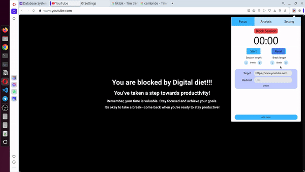
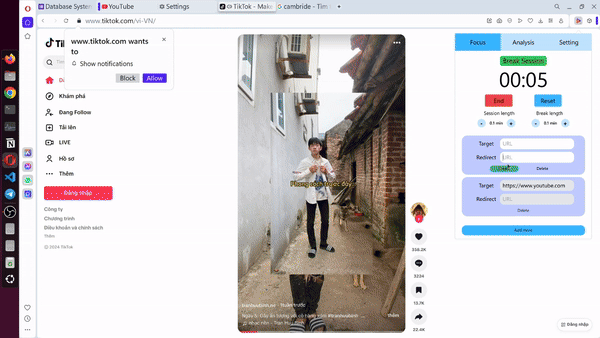
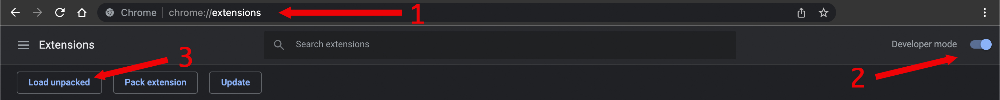

# Digital Diet

Build a browser extension that helps users detox from the internet by reducing the time they spend on distracting websites. 
Target Browsers: Chrome, Firefox, Safari, Opera, Edge. Support many modes: 
    - Block website completely 
    - Set time for blocking and unblocking alternatively
    - Redirect website instead of blocking 
    - Delay scroll video (TikTok, Youtube, ...)
    - Track time for each website and draw insight (data is stored in local browser for private save, you can turn on/off this feature)
    - Send email daily for summary performace (you can turn on/off this feature)

## User manual: 
**1 Block** Create card -> add url target -> save -> set blocking time


**2 Delay scroll video** Create card -> add url target -> save -> set blocking time -> go to setting -> add number of seconds and turn on delay feature


**3 Unblock and block** Create card -> add url target -> save -> set blocking time -> set unblocking time 


**4 Redirect** Create card -> add url target -> add url redirect -> save -> set blocking time



## Installation:
    1) Git clone or download file and unzip on a folder 
    2) Go to the extensions tab on google chrome (chrome://extensions/)
    3) Enable "Developer mode" on the top right of the tab
    4) Press on "Load unpacked" new feature that appeared on top left corner
    5) Browse the path you downloaded the extension and choose select
    6) Enjoy 


## Build project
```sh
npm run build
```

## Run project 
```sh
npm run dev
```

## Project structure

```py
📦src
 ┣ 📂background                 # Event handler run in background of extension
 ┣ 📂components                 # Reusable components across the popup 
 ┣ 📂content                    # Interact with web browser inferface
 ┣ 📂pages                      # Each page for popup screen 
 ┣ 📂popup                      # Popup screen 
 ┗ 📜mainfest.json              # Config-file for extension
```
