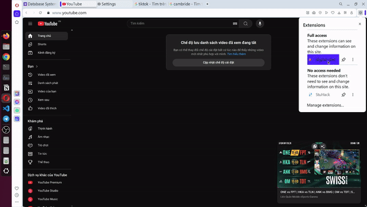

# Digital Diet

Build a browser extension that helps users detox from the internet by reducing the time they spend on distracting websites. 
Target Browsers: Chrome, Firefox, Safari, Opera, Edge. Support many modes: 
    - Block website completely 
    - Set time for blocking and unblocking alternatively
    - Redirect website instead of blocking 
    - Delay scroll video (TikTok, Youtube, ...)
    - Track time for each website and draw insight (data is stored in local browser for private save, you can turn on/off this feature)
    - Send email daily for summary performace (you can turn on/off this feature)

## User manual: 
**1 Block** Create card -> add url target -> save -> set blocking time


**2 Delay scroll video** Create card -> add url target -> save -> set blocking time -> go to setting -> add number of seconds and turn on delay feature


**3 Unblock and block** Create card -> add url target -> save -> set blocking time -> set unblocking time 


**4 Redirect** Create card -> add url target -> add url redirect -> save -> set blocking time


## How to use it


## Build project
```sh
npm run build
```

## Run project 
```sh
npm run dev
```

## Project structure

```py
📦src
 ┣ 📂background                 # Event handler run in background of extension
 ┣ 📂components                 # Reusable components across the popup 
 ┣ 📂content                    # Interact with web browser inferface
 ┣ 📂pages                      # Each page for popup screen 
 ┣ 📂popup                      # Popup screen 
 ┗ 📜mainfest.json              # Config-file for extension
```
